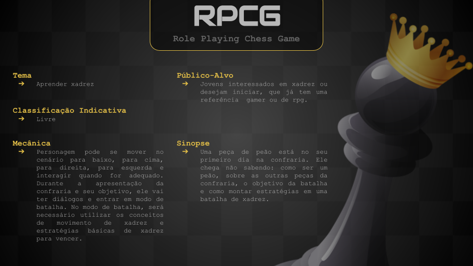

# **[ RPCG ]  _Role Playing Chess Game_**

Projeto integrador de um jogo educacional: este jogo conta sobre um peça de peão no seu primeiro dia na confraria. 
Aprenda junto do peão, conceitos básicos de xadrez de maneira mais lúdica que tutoriais engessados na internet. 


## One Sheet Paper




## Acesso ao jogo 
> **Observação: **os passos a seguir é para Sistema Operacional Linux  

1. Verificar a instalação do gcc.
    ```bash
    $ gcc --version
    ```
    Caso não tenha o gcc instalado deve se instalar o pacote build-essencial, utilizando os dois seguintes comandos:
    ```bash
    $ sudo apt update
    $ sudo apt install build-essential
    ```

2. Instalar o pacote de jogo [Allegro][https://github.com/liballeg/allegro_wiki/wiki].
    ```bash
    $ sudo apt-get install liballegro*5.2 liballegro*5-dev
    ```
    Caso não funcione, [clique aqui][https://github.com/liballeg/allegro_wiki/wiki/Quickstart] para comandos alternativos.

3. Compilar os arquivos do projeto com o seguinte comando: 
    ```bash
    $ gcc main.c -o game $(pkg-config allegro-5 allegro_font-5 allegro_primitives-5 allegro_audio-5 allegro_acodec-5 allegro_image-5 allegro_ttf-5 --libs --cflags)
    ```
    Para inicializar o jogo:
    ```bash
    ./game
    ```

## Organização do projeto

.
├── ./.gitignore
├── ./README.md
├── ./main.c
└── ./src
    ├── ./src/audio
    ├── ./src/fonts
    ├── ./src/images
    ├── ./src/script
    ├── ./src/tiles
    ├── ./src/audio.h
    ├── ./src/map.h
    ├── ./src/npc.h
    ├── ./src/parallel_game.h
    ├── ./src/player.h
    ├── ./src/screenplay.h
    ├── ./src/stand_screen.h
    └── ./src/structure.h


